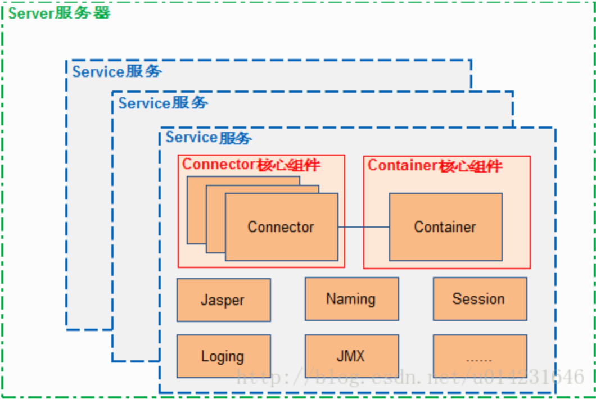
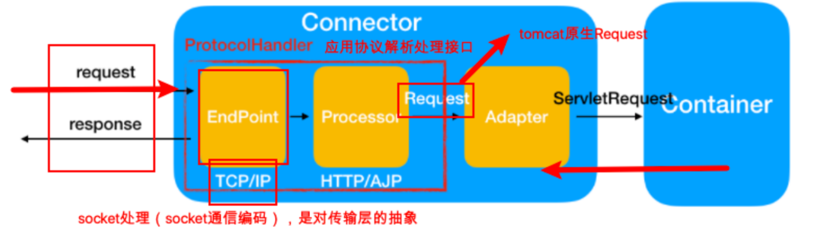
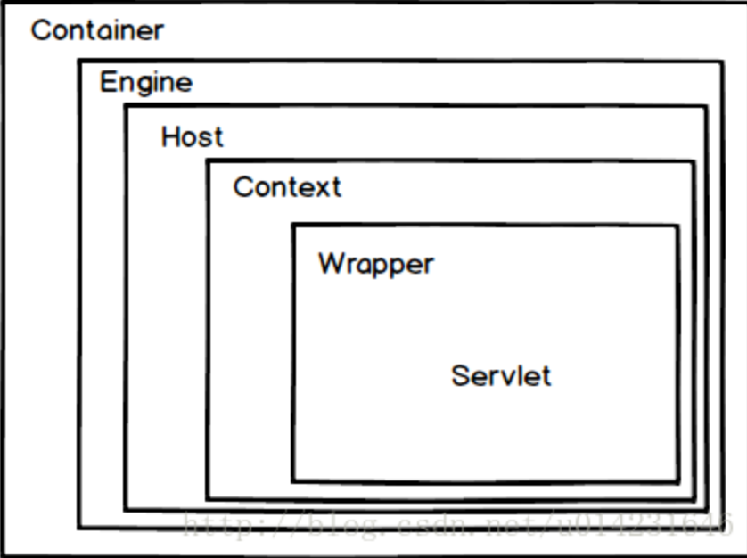

# 请详细描述Tomcat体系结构（图⽂并茂）

### 1.Tomcat结构图

​	Tomcat主要组件：服务器Server，服务Service，连接器Connector、容器Container。连接器Connector和容器Container是Tomcat的核心。

>**Catalina**
>
>负责解析Tomcat的配置⽂件（server.xml） , 以此来创建服务器Server组件并进⾏管理
>
>**Server**
>
>服务器表示整个Catalina Servlet容器以及其它组件，负责组装并启动Servlaet引擎,Tomcat连接器。Server通过实现Lifecycle接⼝，提供了⼀种优雅的启动和关闭整个系统的⽅式
>
>**Service**
>
>服务是Server内部的组件，⼀个Server包含多个Service。它将若⼲个Connector组件绑定到⼀个Container
>
>**Container**
>
>容器，负责处理⽤户的servlet请求，并返回对象给web⽤户的模块

​	一个Container容器和一个或多个Connector组合在一起，加上其他一些支持的组件共同组成一个Service服务，有了Service服务便可以对外提供能力了，但是	Service服务的生存需要一个环境，这个环境便是Server，Server组件为Service服务的正常使用提供了生存环境，Server组件可以同时管理一个或多个Service服务。

### 2.Connector

一个Connecter将在某个指定的端口上侦听客户请求，接收浏览器的发过来的 tcp 连接请求，创建一个 Request 和 Response 对象分别用于和请求端交换数据，然后会产生一个线程来处理这个请求并把产生的 Request 和 Response 对象传给处理Engine(Container中的一部分)，从Engine出获得响应并返回客户。 
Tomcat中有两个经典的Connector，一个直接侦听来自Browser的HTTP请求，另外一个来自其他的WebServer请求。HTTP/1.1 Connector在端口8080处侦听来自客户Browser的HTTP请求，AJP/1.3 Connector在端口8009处侦听其他Web Server（其他的HTTP服务器）的Servlet/JSP请求。 
Connector 最重要的功能就是接收连接请求然后分配线程让 Container 来处理这个请求，所以这必然是多线程的，多线程的处理是 Connector 设计的核心。

### 3.Container

 Container是容器的父接口，该容器的设计用的是典型的责任链的设计模式，它由四个自容器组件构成，分别是Engine、Host、Context、Wrapper。这四个组件是负责关系，存在包含关系。通常一个Servlet class对应一个Wrapper，如果有多个Servlet定义多个Wrapper，如果有多个Wrapper就要定义一个更高的Container，如Context。 Container组件下有⼏种具体的组件，分别是E**ngine、Host、Context和Wrapper**。这4种组件（容器）是⽗⼦关系。Tomcat通过⼀种分层的架构，使得Servlet容器具有很好的灵活性。

- Engine

> 表示整个Catalina的Servlet引擎，⽤来管理多个虚拟站点，⼀**个Service最多只能有⼀个Engine，但是⼀个引擎可包含多个Host**

- Host

> 代表⼀个虚拟主机，或者说⼀个站点，可以给Tomcat配置多个虚拟主机地址，**⽽⼀个虚拟主机下可包含多个Context**

- Context

> 表示⼀个Web应⽤程序， **⼀个Web应⽤可包含多个Wrapper**

- Wrapper

> 表示⼀个Servlet，Wrapper 作为容器中的最底层，**不能包含⼦容器**

### 4.其他组件

  Tomcat 还有其它重要的组件，如安全组件 security、logger 日志组件、session、mbeans、naming 等其它组件。这些组件共同为 Connector 和 Container 提供必要的服务。

